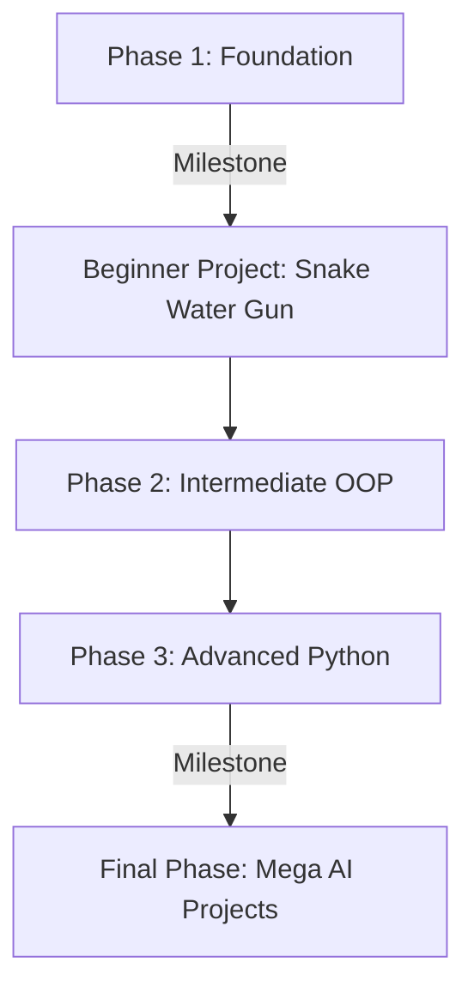

# 🐍 Python Mastery with Harsh

[](https://github.com/lucifer01430/python-mastery-with-harsh)
[](LICENSE)
[](https://www.python.org/)
[](#design-and-aesthetics)

Welcome to **Python Mastery with Harsh**! This is a complete, beginner-friendly Python learning platform designed to take you from absolute zero to building real-world AI-powered applications. 

Created and structured by a working developer, this platform provides an interactive curriculum, coding exercises, practice problems, and hands-on projects, entirely free of charge.

🚀 **Live Site:** [https://lucifer01430.github.io/python-mastery-with-harsh/](https://lucifer01430.github.io/python-mastery-with-harsh/)

---

## 🌟 Key Features

* **Interactive Learning Notes:** Structured, highly readable explanations of Python fundamentals, syntax patterns, and best practices.
* **Local Progress Tracking:** Track your progress as you move through chapters and projects. It syncs automatically in your browser using local storage (`localStorage`) without requiring any login database.
* **Premium Glassmorphic Design:** Modern, sleek user interface with curated color palettes, elegant dark themes, custom gradients, and micro-animations.
* **Hands-on Projects:** Reinforce your understanding with real-world builds, ranging from logic-based games to voice-controlled AI assistants.
* **Counter & Stats:** Live visualization of modules completed, learning hours, and course statistics.
* **Responsive Layout:** Optimized for mobile, tablet, and desktop screens.

---

## 🗺️ Course Roadmap

The course is structured into five distinct phases, taking you step-by-step from syntax basics to artificial intelligence.



### 📚 Detailed Curriculum

#### 1. Foundation Level (Phase 1)
* **Chapter 01 — Getting Started:** Installation, Python REPL, Pip & Modules, Comments, and your first Python program.
* **Chapter 02 — Variables & Data Types:** Memory spaces, data types (`int`, `float`, `str`, `bool`, `None`), operator types, type casting, and reading user input.
* **Chapter 03 — Working with Strings:** Slicing, string methods, formatting, and f-strings. *(Coming Soon)*
* **Chapter 04 — Lists & Tuples:** Storing multiple elements, list mutation methods, tuple packing, and indexing. *(Coming Soon)*
* **Chapter 05 — Dictionaries & Sets:** Key-value stores, unique sets, and CRUD operations. *(Coming Soon)*
* **Chapter 06 — Decision Making:** `if`, `elif`, `else` conditionals, nested logic, and ternary operators. *(Coming Soon)*
* **Chapter 07 — Loops & Iteration:** Repeating code blocks using `for` and `while` loops, iteration control (`break`, `continue`). *(Coming Soon)*
* **Chapter 08 — Functions & Recursion:** Code reusability (`def`), parameters, return statements, and recursion concepts. *(Coming Soon)*

#### 🎯 Milestone: Beginner Project
* **Project 01 — Snake Water Gun Game 🎮:** A terminal-based game using conditional flow, logic loops, and the random module.

#### 2. Intermediate Level (Phase 2)
* **Chapter 09 — File Handling & Data Storage:** Read/write operations, using context managers (`with` block), and handling JSON formats. *(Coming Soon)*
* **Chapter 10 — Object-Oriented Programming (OOP):** Creating custom classes, object instantiation, variables, and the `__init__` constructor. *(Coming Soon)*
* **Chapter 11 — Advanced OOP & Inheritance:** Inheritance levels, method overriding, super() keyword, operator overloading, polymorphism, and encapsulation. *(Coming Soon)*

#### 3. Advanced Level (Phase 3)
* **Chapter 12 — Modern Python Features:** The walrus operator (`:=`), match-case switch expressions, type hints, exception handling block (`try/except/finally`), enumerate function, and list/dict comprehensions. *(Coming Soon)*
* **Chapter 13 — Productivity & Dev Tools:** Virtual environments, lambda expressions, map/filter/reduce, `pip freeze`, and script organization. *(Coming Soon)*

#### 🤖 Final Phase: Mega Projects
* **Mega Project 01 — Jarvis AI Assistant 🗣️:** Voice-activated assistant using speech recognition, web scraping, and automation to operate your computer. *(Coming Soon)*
* **Mega Project 02 — Auto Reply AI Chatbot 💬:** Automated smart chatbot that uses messaging integrations and API-based language model reasoning. *(Coming Soon)*

---

## 🛠️ Technology Stack

The learning platform is built with high performance and accessibility in mind, utilizing modern client-side technologies:

* **Core Structure:** HTML5
* **Styling & Layout:** CSS3 Custom Variables, Glassmorphic styling, and [Bootstrap 5](https://getbootstrap.com/)
* **Interactions & Progress Logic:** Vanilla JavaScript (ES6+) utilizing Web Storage (`localStorage`)
* **Scroll Animations:** [AOS (Animate on Scroll)](https://michalsnik.github.io/aos/)
* **Typography & Styling Assets:** [Google Fonts](https://fonts.google.com/) (*Syne, Space Grotesk, Fira Code*), [Font Awesome Icons](https://fontawesome.com/)

---

## 📂 Directory Structure

```text
python-coarse/
│
├── index.html               # Main landing page & dashboard
├── coming-soon.html         # Sneak peek page for upcoming content
│
├── Chapter-1/               # Chapter 1: Modules, Comments & PIP
│   ├── index.html           # Chapter 1 learning notes & exercises
│   └── assets/              # Chapter 1 specific styles and scripts
│
├── Chapter-2/               # Chapter 2: Variables & Data Types
│   ├── index.html           # Chapter 2 learning notes & exercises
│   └── assets/              # Chapter 2 specific styles and scripts
│
└── assets/                  # Global shared assets
    ├── css/
    │   └── style.css        # Main glassmorphism styles and dark theme
    ├── js/
    │   └── scripts.js       # Global progress tracker & dashboard interactions
    ├── img/                 # Images & profile assets
    └── favicon/             # Multi-device platform icons
```

---

## 💻 Local Setup

If you want to run this platform locally on your computer:

1. **Clone the repository:**
   ```bash
   git clone https://github.com/lucifer01430/python-mastery-with-harsh.git
   ```
2. **Navigate to the directory:**
   ```bash
   cd python-mastery-with-harsh
   ```
3. **Open the files:**
   * Double-click `index.html` to open it in your browser.
   * *Alternatively*, use the **Live Server** extension in VS Code to run a local development server.

---

## 👨‍🏫 About the Instructor

**Harsh Pandey** is a professional Software Developer, Python enthusiast, and Web Developer. He believes in learning-by-doing and building real software solutions. 
* **GitHub:** [@lucifer01430](https://github.com/lucifer01430)
* **Portfolio Website:** [Harsh's Portfolio](https://lucifer01430.github.io/Portfolio)

---

## 🤝 Contributing

Contributions are welcome! If you want to contribute to the platform (e.g., adding note updates, fixing typos, improving styling):

1. Fork the Project.
2. Create your Feature Branch (`git checkout -b feature/AmazingFeature`).
3. Commit your Changes (`git commit -m 'Add some AmazingFeature'`).
4. Push to the Branch (`git push origin feature/AmazingFeature`).
5. Open a Pull Request.

---

## 📄 License

Distributed under the MIT License. See `LICENSE` for more information.

---
*Built with ❤️ by Harsh Pandey for developers and students worldwide.*
